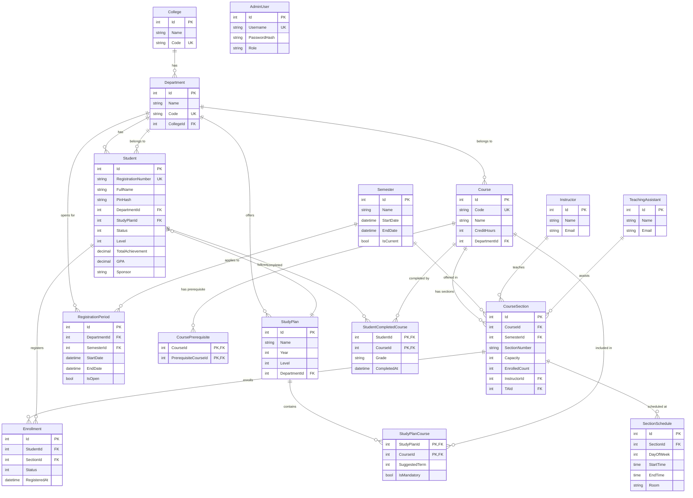

# Entity Relationship Diagram (ERD)

The database schema is designed following **Clean Architecture** principles with **Entity Framework Core Code First** approach. The database contains **17 entities** with proper relationships, constraints, and indexes.

---

## 📊 Complete ERD (Mermaid)

---

## 📋 Entities Summary

| #   | Entity                     | Purpose                                           | Rows (Seed) |
| --- | -------------------------- | ------------------------------------------------- | ----------- |
| 1   | **College**                | Top-level academic unit (Engineering, Management) | 2           |
| 2   | **Department**             | Academic department (ECE, CPE, BUA, etc.)         | 11          |
| 3   | **Student**                | Master's degree student with authentication       | 12          |
| 4   | **StudyPlan**              | Course requirements per department                | 11          |
| 5   | **StudyPlanCourse**        | Junction between StudyPlan and Course             | ~92         |
| 6   | **Course**                 | Course catalog                                    | 120         |
| 7   | **CoursePrerequisite**     | Self-referencing prerequisite graph               | ~110        |
| 8   | **Semester**               | Academic semester (Fall/Spring)                   | 2           |
| 9   | **RegistrationPeriod**     | Registration window per department                | 11          |
| 10  | **Instructor**             | Teaching staff                                    | 8           |
| 11  | **TeachingAssistant**      | Assistant staff                                   | 4           |
| 12  | **CourseSection**          | Specific offering of a course                     | 47          |
| 13  | **SectionSchedule**        | Time/location of a section                        | ~110        |
| 14  | **Enrollment**             | Student registration in a section                 | 0 (runtime) |
| 15  | **StudentCompletedCourse** | Completed courses (for prerequisites)             | ~125        |
| 16  | **AdminUser**              | Admin authentication                              | 1           |

---

## 🔗 Relationships Summary

### One-to-Many (1:N)

| From              | To                     | Cardinality |
| ----------------- | ---------------------- | ----------- |
| College           | Department             | 1 → N       |
| Department        | Student                | 1 → N       |
| Department        | StudyPlan              | 1 → N       |
| Department        | Course                 | 1 → N       |
| Department        | RegistrationPeriod     | 1 → N       |
| StudyPlan         | StudyPlanCourse        | 1 → N       |
| Course            | StudyPlanCourse        | 1 → N       |
| Course            | CourseSection          | 1 → N       |
| Course            | CoursePrerequisite     | 1 → N       |
| Course            | StudentCompletedCourse | 1 → N       |
| Semester          | CourseSection          | 1 → N       |
| Semester          | RegistrationPeriod     | 1 → N       |
| Instructor        | CourseSection          | 1 → N       |
| TeachingAssistant | CourseSection          | 1 → N       |
| CourseSection     | SectionSchedule        | 1 → N       |
| CourseSection     | Enrollment             | 1 → N       |
| Student           | Enrollment             | 1 → N       |
| Student           | StudentCompletedCourse | 1 → N       |

### Many-to-Many (M:N) — via Junction

| Entity A  | Entity B      | Junction               | Notes                              |
| --------- | ------------- | ---------------------- | ---------------------------------- |
| StudyPlan | Course        | StudyPlanCourse        | Has `SuggestedTerm`, `IsMandatory` |
| Course    | Course        | CoursePrerequisite     | Self-referencing                   |
| Student   | CourseSection | Enrollment             | Has `Status`, `RegisteredAt`       |
| Student   | Course        | StudentCompletedCourse | Has `Grade`, `CompletedAt`         |

---

## 🔑 Key Constraints

### Primary Keys

| Table                  | Type                                           |
| ---------------------- | ---------------------------------------------- |
| Most tables            | Single Column `Id` (Identity)                  |
| StudyPlanCourse        | **Composite** (StudyPlanId, CourseId)          |
| CoursePrerequisite     | **Composite** (CourseId, PrerequisiteCourseId) |
| StudentCompletedCourse | **Composite** (StudentId, CourseId)            |

### Unique Constraints

| Table               | Column(s)                             |
| ------------------- | ------------------------------------- |
| Colleges            | Code                                  |
| Departments         | Code                                  |
| Students            | RegistrationNumber                    |
| Courses             | Code                                  |
| AdminUsers          | Username                              |
| CourseSections      | (CourseId, SemesterId, SectionNumber) |
| Enrollments         | (StudentId, SectionId)                |
| RegistrationPeriods | (DepartmentId, SemesterId)            |

### Check Constraints

| Table               | Constraint                           |
| ------------------- | ------------------------------------ |
| Courses             | CreditHours > 0                      |
| CourseSections      | Capacity > 0                         |
| CourseSections      | EnrolledCount BETWEEN 0 AND Capacity |
| SectionSchedules    | StartTime < EndTime                  |
| CoursePrerequisites | CourseId <> PrerequisiteCourseId     |

### Delete Behaviors

| Relationship                | Behavior     | Reason                                     |
| --------------------------- | ------------ | ------------------------------------------ |
| Student → Department        | **Restrict** | Cannot delete department with students     |
| Student → StudyPlan         | **SetNull**  | Student survives if plan is deleted        |
| CoursePrerequisite → Course | **Restrict** | Cannot delete course with prerequisites    |
| Enrollment → Student        | **Cascade**  | Delete enrollments when student is deleted |
| Enrollment → CourseSection  | **Restrict** | Cannot delete section with enrollments     |

---

## 🎨 Legend

| Symbol  | Meaning                         |
| ------- | ------------------------------- | ----- | ----------------- | --------------------------- |
| `PK`    | Primary Key                     |
| `FK`    | Foreign Key                     |
| `UK`    | Unique Key                      |
| `PK,FK` | Composite Primary & Foreign Key |
| `       |                                 | --o{` | One-to-Many (1:N) |
| `}o--   |                                 | `     | Many-to-One (M:1) |
| `       |                                 | --o   | `                 | One-to-Zero-or-One (1:0..1) |
