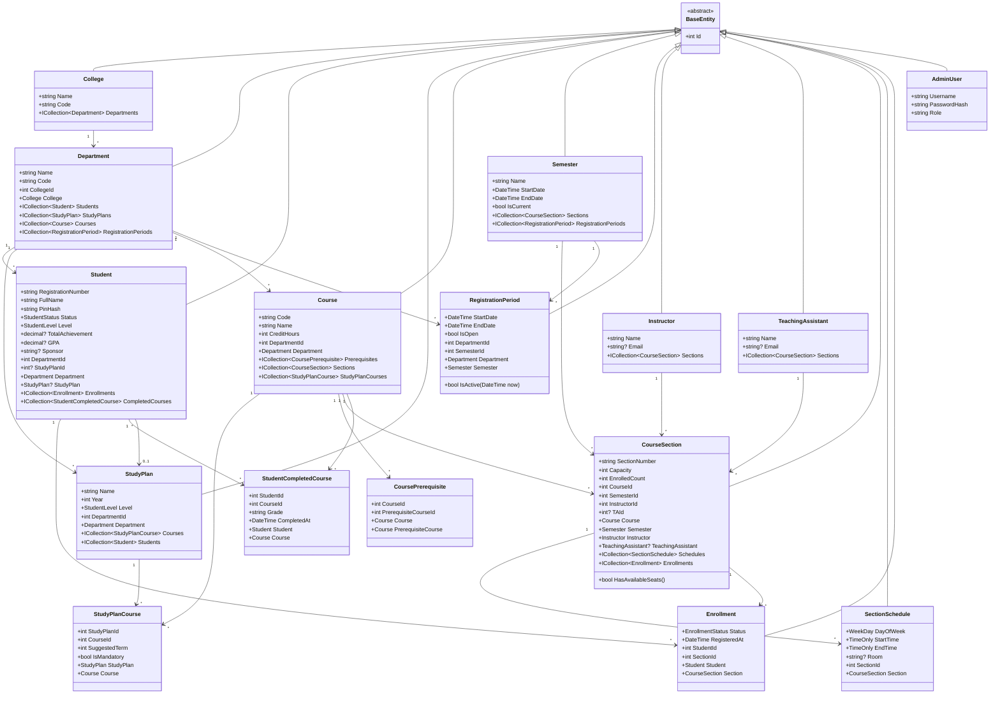

# Class Diagram

The **Domain Layer** contains 17 entities organized in a **Clean Architecture** structure. All entities inherit from `BaseEntity` (except those with composite keys).

---

## 📊 Complete Class Diagram (Mermaid)



---

## 🎯 Entities Overview

### BaseEntity (Abstract)

```csharp
public abstract class BaseEntity
{
    public int Id { get; set; }
}
```

**Purpose:** Provides common `Id` property for most entities. **3 entities with composite keys** don't inherit from this.

---

### Academic Structure

#### College

**Purpose:** Top-level academic unit (Engineering, Management).

**Key Properties:**
- `Name` — College name
- `Code` — Short code (ENG, MGT)
- `Departments` — Navigation to departments

---

#### Department

**Purpose:** Academic department within a college.

**Key Properties:**
- `CollegeId` — FK to College
- `College` — Navigation
- Collections: Students, StudyPlans, Courses, RegistrationPeriods

---

#### Student

**Purpose:** Master's degree student.

**Key Properties:**
- `RegistrationNumber` — Unique identifier
- `PinHash` — BCrypt hashed PIN
- `Status` — Active / Graduated / Suspended / Dismissed
- `Level` — Bachelor / Master
- `DepartmentId`, `StudyPlanId` — FKs

---

#### StudyPlan

**Purpose:** Curriculum for a specific department + level.

**Key Properties:**
- `Name`, `Year`
- `Level` — Bachelor / Master
- `Courses` — Collection of StudyPlanCourse

---

#### StudyPlanCourse

**Purpose:** Junction entity between StudyPlan and Course.

**Key Properties:**
- Composite PK: `(StudyPlanId, CourseId)`
- `SuggestedTerm` — 1 to 10
- `IsMandatory` — Required or elective

**Why no BaseEntity?** Composite Primary Key.

---

### Courses

#### Course

**Purpose:** Course catalog entry.

**Key Properties:**
- `Code` — Unique (e.g., CS101)
- `Name`, `CreditHours`
- `Prerequisites` — Self-referencing collection

---

#### CoursePrerequisite

**Purpose:** Self-referencing M:N for prerequisites.

**Key Properties:**
- Composite PK: `(CourseId, PrerequisiteCourseId)`
- Two navigation properties (Course, PrerequisiteCourse)

**Constraint:** `CourseId <> PrerequisiteCourseId` (no self-prerequisite).

---

#### CourseSection

**Purpose:** Specific offering of a course in a semester.

**Key Properties:**
- `SectionNumber`, `Capacity`, `EnrolledCount`
- References: Course, Semester, Instructor, TA
- `HasAvailableSeats()` — Domain method

---

#### SectionSchedule

**Purpose:** Time and location of a section.

**Key Properties:**
- `DayOfWeek` (WeekDay enum)
- `StartTime`, `EndTime` (TimeOnly)
- `Room` (nullable)

**Constraint:** `StartTime < EndTime`.

---

### Time & Actions

#### Semester

**Purpose:** Academic term.

**Key Properties:**
- `Name` (e.g., "First 2025/2026")
- `StartDate`, `EndDate`
- `IsCurrent` — Only one active

---

#### RegistrationPeriod

**Purpose:** Registration window per department.

**Key Properties:**
- `IsOpen` — Manual toggle
- `StartDate`, `EndDate` — Automatic window
- `IsActive(now)` — Domain method

---

#### Enrollment

**Purpose:** Student registration in a section.

**Key Properties:**
- `Status` — Registered / Dropped
- `RegisteredAt` — UTC timestamp
- Composite uniqueness: `(StudentId, SectionId)`

---

#### StudentCompletedCourse

**Purpose:** Track completed courses (for prerequisite validation).

**Key Properties:**
- Composite PK: `(StudentId, CourseId)`
- `Grade`, `CompletedAt`

---

### People

#### Instructor

**Purpose:** Teaching staff.

**Key Properties:**
- `Name`, `Email` (nullable)
- Collection of CourseSections

---

#### TeachingAssistant

**Purpose:** Assistant staff.

**Key Properties:** Same as Instructor.

---

#### AdminUser

**Purpose:** Admin authentication.

**Key Properties:**
- `Username` (unique)
- `PasswordHash` (BCrypt)
- `Role` — "Admin"

---

## 🔄 Enums

### StudentStatus

```csharp
public enum StudentStatus
{
    Active = 1,      // Can register
    Graduated = 2,   // Cannot register
    Suspended = 3,   // Cannot register
    Dismissed = 4    // Cannot register
}
```

### StudentLevel

```csharp
public enum StudentLevel
{
    Bachelor = 1,
    Master = 2
}
```

### EnrollmentStatus

```csharp
public enum EnrollmentStatus
{
    Registered = 1,
    Dropped = 2
}
```

### WeekDay

```csharp
public enum WeekDay
{
    Saturday = 0,
    Sunday = 1,
    Monday = 2,
    Tuesday = 3,
    Wednesday = 4,
    Thursday = 5,
    Friday = 6
}
```

---

## 💡 Design Decisions

### Why BaseEntity?

- DRY: Avoid repeating `Id` in every class
- Convention: EF Core recognizes `Id` as PK automatically

### Why Composite Keys?

- Prevent duplicates: Can't register same course twice in same plan
- Natural keys: `(StudentId, SectionId)` already unique

### Why Navigation Properties?

- EF Core requires both FK (`DepartmentId`) and Navigation (`Department`)
- Provides IntelliSense + type safety

### Why `= null!`?

- Null-forgiving operator: Tells compiler navigation will be populated by EF Core
- Alternative would be `= null`, generating warnings

### Why `= string.Empty` and `= new()`?

- Null safety: Prevent NullReferenceException
- C# 8+ nullable reference types require explicit initialization